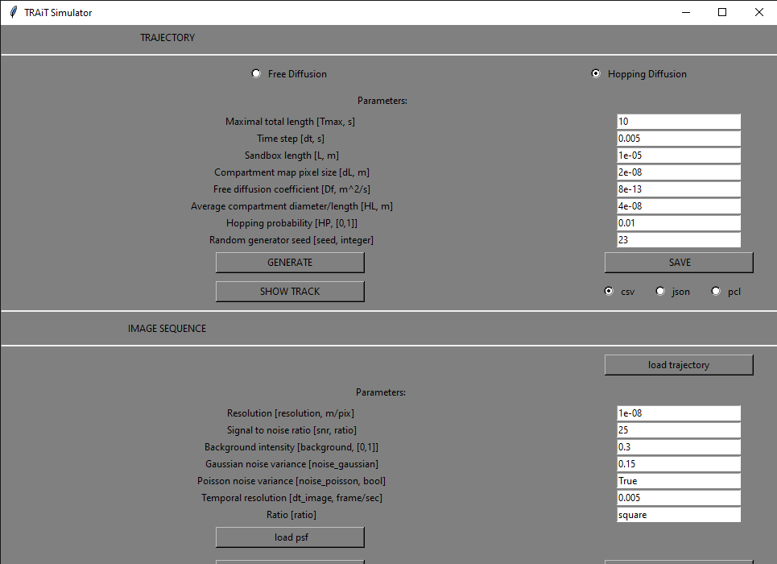

.. _simulator_gui:

Simulator GUI
=============

Starting the GUI
----------------

The GUI can be started from command line by entering ``trait2d_simulator_gui``. The GUI and its components are described below.

Description of the GUI
----------------------

1.

   a. **Select the free diffusion model**

   b. **Select the hopping difffusion model**

2. **Parameter: maximal total length (** ``Tmax`` **) in seconds**: This is the maximum simulation duration. The simulation might be short if the particle diffuses out of the simulation volume.

3. **Parameter: time step (** ``dt`` **) in seconds**: This is the temporal discretization of the simulation domain.

4. **Parameter: sandbox length (** ``L`` **) in m**: This is the physical size of the simulation domain.

5. **Parameter: compartment map pixel size (** ``dL`` **) in m**: This is the physical discretization of the simulation domain.

6. **Parameter: free diffusion coefficient (** ``Df`` **) in m²/s**

7. **Parameter: average compartment diameter / length (** ``HP`` **) in m. This parameter is used by the hopping diffusion model.

8. **Parameter: Hopping probability (** ``HL`` **), between 0 and 1**: Describes the probability of hopping diffusion, e.g. the probability of changing hopping diffusion cells.

9. **Parameter: Random generator seeds (** ``seed`` **, integer)**: This ia an optional integer used to initialize the random number generator. This is mostly used for reproducibility (initializing a simulation with a given seed will give the same simulation results every time). Keep empty to use a random seed.

10. **Run the diffusion simulation** using the diffusion model selected in 1a/1b, and the diffusion parameters described by 2-9. Generate must be used every time the diffusion parameters are changed.

11. **Visualize the simulated diffusion track.** Must generate (10) beforehand.

12. **Save the simulated track to a file.** Uses the selected file format (13).

13. **Exported track file format.** Available formats are ``.csv``, ``.json``, and ``.pcl``.

14. **Load a track file (simulated track, detected track, ...)**. If a track was simulated using a diffusion model, it can be used directly to generate the movie (if load trajectory is not used).

15. **Parameter: resolution (** ``resolution`` **) in m/pix**: This is the movie physical resolution in m per pixel. If the track's particle positions are expressed at a finer resolution, they will be rounded to the closest pixel position given by this parameter.

16. **Parameter: signal-to-noise-ration (SNR)**: Gives the ratio between the signal and the simulated noise. Higher SNR will result in  higher particle contrast compared to the background.

17. **Parameter: background intensity**: Average background intensity of the simulated movie.

18. **Parameter: Gaussian noise variance**: Represents the background noise.

19. **Parameter: Poisson noise variance**: If ``True``, Poisson noise will be added to the simulated movie.

20. **Temporal resolution (frame/sec)**: This is the temporal resolution of the simulated movie. The track positions for all time frames in between the discrete times of the simulated movie are integrated.

21. **Ratio**: If set to square, the simulated movie will have the same height and width. Otherwise the movie dimension will be given by the particle's track positions.

22. **Load PSF**: Optional. Used to load a point spread function stack. The Z-axis must be the first dimension of the stack. The middle frame along dimension 0 is used for the convolution.

23. **Generate and show the simulated movie** given the loaded track and the simulation parameters.

24. **Save the simulated movie as an image stack.**