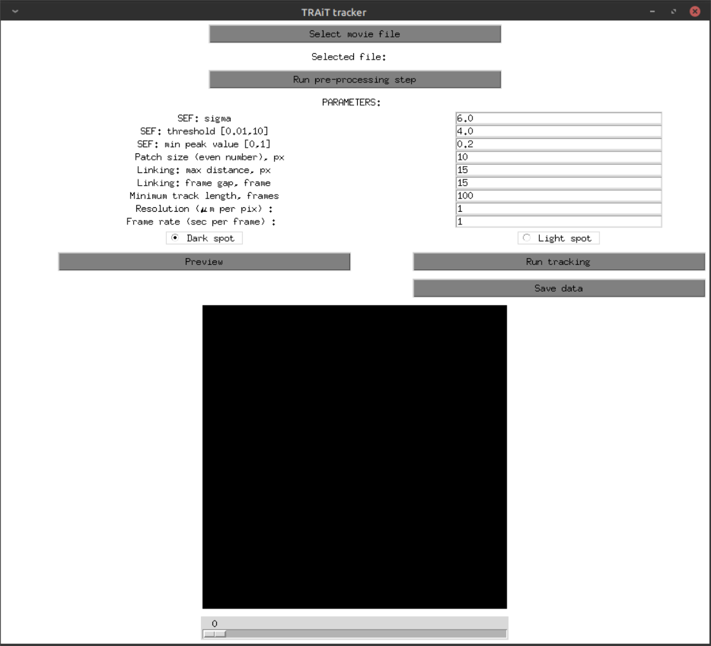

.. _tracker_gui:

Tracker GUI
=============

The tracker allows to detect and track particles for further trajectory analysis. It accepts 8 bit TIFF stack as an input frame sequence. The tracker GUI provides options to set parameters, preview detection results, track the particles and save the trajectories to csv files.

Starting the GUI
----------------

The GUI can be started from command line by entering ``trait2d_tracker_gui``. The GUI and its components are described below.

Description of the GUI
----------------------

1. **Select movie file**: Select and load an image sequence.
2. **Run pre-processing step**: Run pre-processing for the entire image sequence (description of the pre-processing steps is provided in the paper and documentation)
3. **SEF: sigma**: Set parameter for the Laplacian-of-Gaussian in the Sport Enhancing Filter (SEF)
4. **SEF: threshold**: Set threshold parameter in the SEF.
5. **SEF: min peak value**: Set minimum acceptable peak value to be detected.
6. **Patch size**: Set patch size for sub-pixel localisation task.
7. **Linking: max distance**: Set maximum acceptable distance for linking.
8. **Linking: frame gap**: Set maximum number of skipped frames for linking.
9. **Minimum track length**: Set minimum track length; trajectories with length less than the number are filtered out.
10. **Resolution**: Effective pixel size of the image sequence (in µm/pix).
11. **Frame rate**: Time interval between localisations (sec).
12. **Select detection mode**

    a. Dark spot

    b. Light spot

13. **Preview**: Preview detection results for the current frame.
14. **Test run**: Run linking for a select range of frames.
15. **Save parameters**: Save set parameters in csv file.
16. **Run tracking algorithm**: Run tracking algorithm and save an image sequence with highlighted trajectories. Close the "save as" window without providing any name if you don't want to save the file.
17. **Load parameters**: Load parameters from a csv file.
18. **Save data**: Save all trajectories into a `.csv` file.
19. **Preview and navigate through the image sequence**

    a. Preview window

    b. Slider
