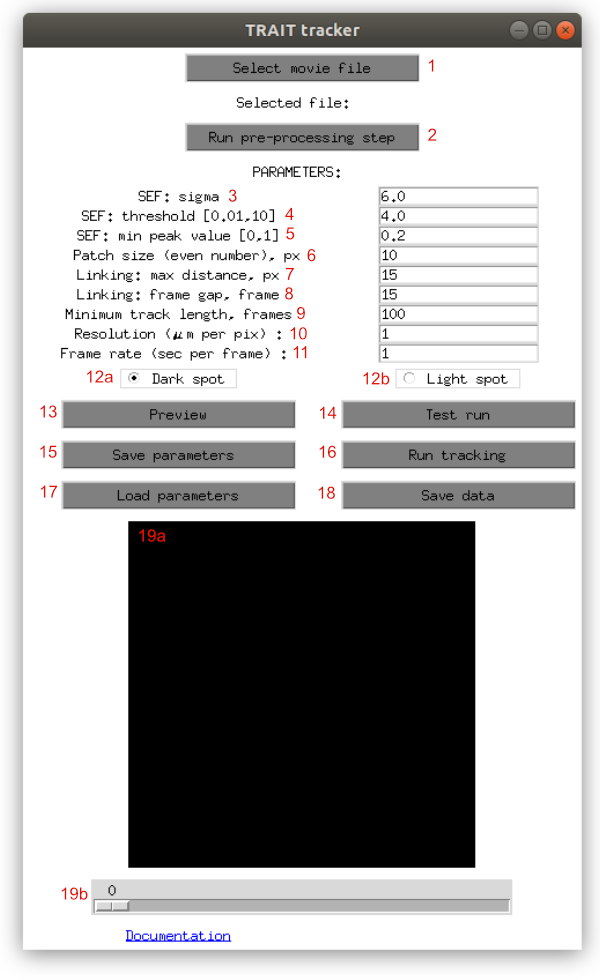

.. _tracker_gui:

Tracker GUI
=============

The tracker allows to detect and track particles for further trajectory analysis. It accepts TIFF stack as an input frame sequence. The tracker GUI provides options to set parameters, preview detection results, track the particles and save the trajectories to csv files.

Starting the GUI
----------------

The GUI can be started from command line by entering ``trait_tracker_gui``. The GUI and its components are described below.

Description of the GUI
----------------------

TODO